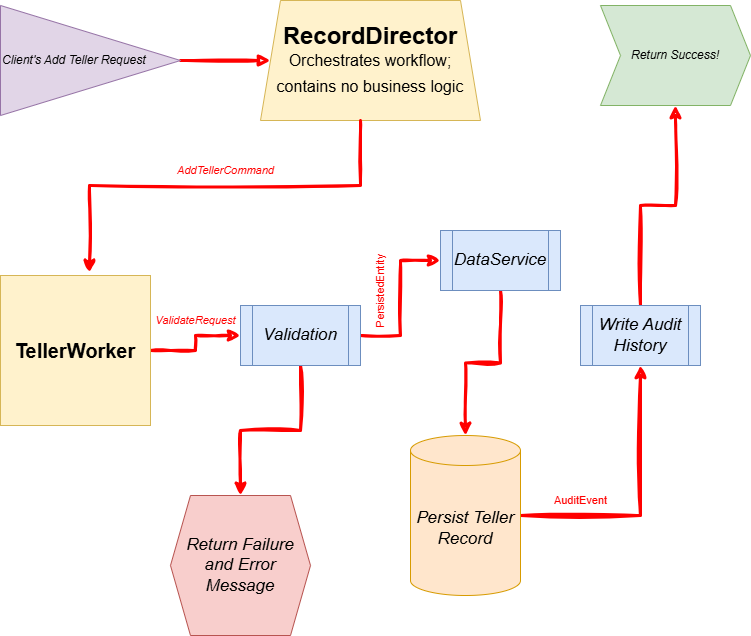

README: TellerRecordAdd

Who this is for: 

This README is a design synopsis intended to demonstrate architecture and engineering decisions. No proprietary code or schemas are included.
Project Overview

This project implements a file maintenance system for managing Teller Information records in a financial services application. The system provides a centralized mechanism for creating, updating, and deleting teller records through a director pattern that routes requests to specialized worker components.

Add Teller WorkFlow:

The following diagram illustrates a typical request flow for creating
a teller record in a regulated, audit-sensitive backend system.

Key goals of this design:
- Clear separation of orchestration and business logic
- Early validation and failure paths
- Explicit persistence and audit side effects
- Technology-agnostic layering
  

Problem Statement

The system needed to support transactional file maintenance operations for teller records with the following requirements:

- Consistency: Ensure data integrity across create operations with optimistic concurrency control
- Auditability: Maintain complete history of all changes for compliance and troubleshooting
- Validation: Enforce field-level permissions and data format constraints
- Extensibility: Support multiple record types through a common interface without tight coupling

Architecture

Components

- RecordDirector: Central coordinator that receives file maintenance requests and routes them to appropriate workers
- TellerWorker: Specialized worker implementing IRecWorker interface to handle Teller Information record operations
- DataService: Data access layer providing CRUD operations with key-based record retrieval
- HistoryWriter: Captures before/after snapshots of records for audit trail
- ExtendedFieldDataProcessing: Handles field-level data transformation, validation, and format conversion
- Validation: Enforces business rules and field-level permissions

Responsibilities

- TellerWorker: Orchestrates add operations, field validation, and history tracking for teller records
- Tools: Provides utility functions for schema introspection, key extraction, and field name mapping
- FieldProcessing: Manages data serialization/deserialization based on field metadata and format codes

Communication Patterns

- Request/Response pattern between RecordDirector and workers
- Service Locator pattern via IApplicationServices for dependency resolution
- Data Transfer Object pattern using RecordRequest and RecordWarningErrorMessage for request/response payloads
- Template Method pattern where worker lifecycle (Initialize ? Validate ? Process) is standardized

Key Design Decisions

Worker Interface (IRecWorker)

Why: Allows RecordDirector to treat all record types uniformly without knowing implementation details
Tradeoff: Adds abstraction layer but enables independent testing and parallel development of workers

Optimistic Concurrency with Before-Image Verification

Why: Uses OldData field in requests to verify record hasn't changed since client read it
Tradeoff: Requires additional comparison logic but prevents lost updates without locking

Field-Level Metadata Driven Processing

Why: Uses enums with attributes (FieldUseAttribute) to determine if fields are file-maintainable
Tradeoff: Reflection overhead but provides single source of truth for field permissions

History Capture on Every Operation

Why: Writes before/after images for audit compliance
Tradeoff: I/O overhead but essential for regulatory requirements and debugging

Patterns & Principles Used
- Strategy Pattern: IRecWorker implementations encapsulate different record processing algorithms
- Dependency Injection: Constructor-based initialization of services promotes testability
- Single Responsibility: Separate concerns for validation, data access, history, and field processing
- Open/Closed: New record types can be added by implementing IRecWorker without modifying RecordDirector
- Fail-Fast: Immediate exception throwing on validation failures or data mismatches
- Idempotency Consideration: Drop operations check existence before attempting deletion

Testing & Reliability

Correctness Measures
- Verify-Before-Update: Compares client's old data against current state using AdjustVerifyField
- Field Format Validation: Data coerced to correct format via AdjustDataFormat before persistence
- Exception Handling: Try-catch blocks with detailed error messages for operation failures
- Comprehensive Logging: Trace statements at each step with elapsed time tracking

Failure Modes Considered
- Record Not Found: Returns error when updating/dropping non-existent records
- Concurrent Modification: Detects when another user changed data between read and write
- Invalid Field Names: Validates field exists in enum before attempting update
- Non-Maintainable Fields: Prevents modification of read-only fields via attribute check
- Update Failures: Validates SetDataInRecord return value and throws on false

What I'd Improve Next
1. Transaction Support: Wrap multi-field updates in transactions to ensure atomicity
2. Async/Await: Convert to async pattern for better scalability under load
3. Batch Operations: Support updating multiple records in single request to reduce round-trips
4. Validation Separation: Extract field validation rules to declarative configuration instead of procedural code
5. Error Recovery: Add retry logic with exponential backoff for transient failures
6. Unit Test Coverage: Add focused tests for edge cases like format conversion and concurrency conflicts
7. Rate Limiting: Protect against accidental bulk operations that could impact system performance
Bonus
Only the “Add” operation was currently wanted. Since it did not take much extra time, I also wrote the “Update” and “Drop” operations.
